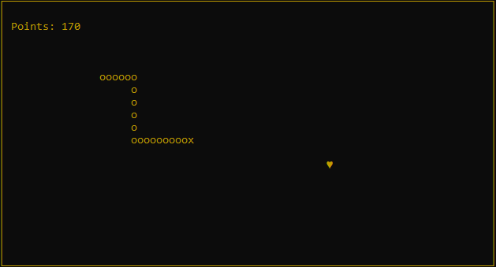

# Snake
>  The old  game classic "Snake" in Python

This is a very simple Python implementation of the game "Snake" using the curses UI framework.

## Installation

You have to install the required packages defined in `requirements.txt`. Consider using a virtual environment or container environment to avoid installing the packages globally which might break other projects.

`$ pip install -r requirements.txt`

## How to play?

Start the game by typing:

`python -m snake`

You can control the snake using the following keys:

|  Action  |  Key       |
| -------- | ---------- |
| Up       | `↑` or `w` |
| Down     | `↓` or `a` |
| Left     | `←` or `s` |
| Right    | `→` or `d` |
| Quit     | `p`        |

## Release History

* 0.2
    * ADD: LICENSE and README
* 0.1
    * ADD: Initial implementation of snake

## Meta

Dennis Loeben – dennis@loeben.de

Distributed under the MIT license. See ``LICENSE`` for more information.

[https://github.com/dennisloe85/snake]